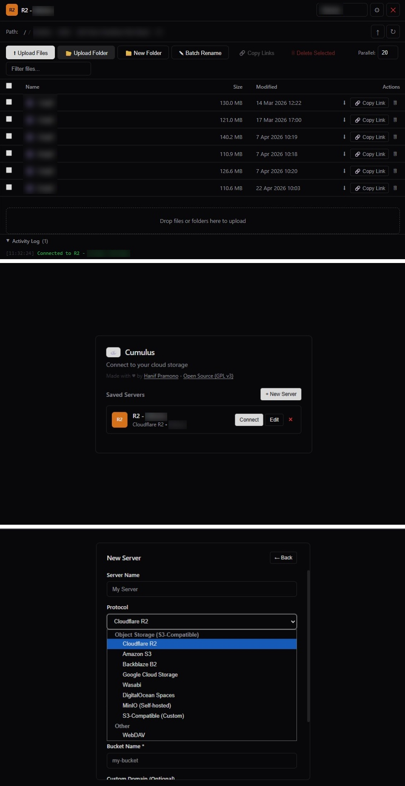

# Cumulus ☁️

**Multi-protocol cloud storage file manager — right in your browser.**

A Chrome extension that lets you browse, upload, download, rename, and manage files across multiple cloud storage providers. Think FileZilla, but as a browser extension.
Running on : Chrome, Vivaldi, Edge, Brave, Opera and All Browsed based Chromium.

Download on Chrome Extension : https://chromewebstore.google.com/detail/cumulus-%E2%80%94-s3-r2-webdav-fi/bcljbdjgihdnccbablncpdhankediple



## Supported Protocols

### Object Storage (S3-Compatible)
| Provider | Status |
|----------|--------|
| Cloudflare R2 | ✅ |
| Amazon S3 | ✅ |
| Backblaze B2 | ✅ |
| Google Cloud Storage | ✅ |
| Wasabi | ✅ |
| DigitalOcean Spaces | ✅ |
| MinIO (Self-hosted) | ✅ |
| Any S3-Compatible | ✅ |

### Other
| Protocol | Status |
|----------|--------|
| WebDAV | ✅ |

## Features

### Multi-Server Management
- Save and switch between multiple storage servers (like FileZilla's Site Manager)
- Quick server switching via dropdown in the header
- Each server stores its own protocol, credentials, and settings
- Auto-reconnect to last active server on startup

### Upload
- **Parallel uploads** — Up to 50 concurrent uploads (configurable, default: 50)
- **Drag & drop** — Drop files or entire folders to upload
- **Folder upload** — Upload entire folder structures with preserved hierarchy
- **Progress tracking** — Real-time progress bar with percentage per file, speed, and ETA
- **Transfer tabs** — Filter by All / Pending / Success / Failed
- **Retry failed** — Retry individual files or all failed uploads at once

### Download
- **Parallel downloads** — Up to 50 concurrent downloads (configurable, default: 20)
- **Folder download** — Select folders to recursively download all contents
- **Preserved folder structure** — Downloaded files keep their original directory structure
- **Real-time progress** — Live progress percentage, download speed (MB/s), and file size
- **Transfer tabs** — Filter by All / Pending / Success / Failed
- **Retry failed** — Retry individual files or all failed downloads at once

### Batch Rename
Advanced batch rename with stackable, reorderable rules and live preview:
- Find & Replace (with regex support)
- Add numbering (prefix/suffix, configurable start/step/padding)
- Change case (lower/upper/title/sentence)
- Trim & clean whitespace
- Insert/remove text at position
- Replace spaces with custom character
- Change file extension
- Add date/time stamps

### File Management
- **File preview** — Preview images, videos, and text files directly in the browser
- **Inline rename** — Double-click any file to rename it
- **Create folders** — Create new folders in any directory
- **Copy / Move / Paste** — Clipboard-style copy or move of files and folders between directories on the same server, with Skip / Replace / Rename conflict resolution (plus "apply to all") when a name already exists at the destination
- **Delete** — Delete files or entire folders recursively
- **Copy public URLs** — Single or bulk copy of file URLs with custom domain support
- **Search / filter** — Quickly filter files in the current directory
- **Sortable columns** — Sort by name, size, or modified date
- **List / Grid view** — Toggle between the classic table view and a grid view with image/video thumbnails (lazy-loaded) and type icons; your preference is remembered

### Security & UI
- **Encrypted credentials** — All credentials are encrypted with AES-256-GCM (PBKDF2 key derivation) before storage
- **Dark theme** — shadcn/ui inspired zinc dark theme
- **Activity log** — Real-time operation log with timestamps
- **Responsive toolbar** — Upload/download parallel counts, search, and bulk actions

## Installation

### From source (Developer mode)

1. Clone this repository:
   ```bash
   git clone https://github.com/hanifpram-ux/cumulus.git
   ```
2. Open Chrome and go to `chrome://extensions/`
3. Enable **Developer mode** (top right toggle)
4. Click **Load unpacked** and select the cloned folder
5. Click the Cumulus icon in the toolbar to open

### CORS Configuration

For S3-compatible storage, you need to configure CORS on your bucket. Example for Cloudflare R2:

```json
[
  {
    "AllowedOrigins": ["chrome-extension://*"],
    "AllowedMethods": ["GET", "PUT", "DELETE", "HEAD", "POST"],
    "AllowedHeaders": ["*"],
    "ExposeHeaders": ["ETag", "Content-Length", "Content-Type", "Last-Modified"],
    "MaxAgeSeconds": 3600
  }
]
```

## Project Structure

```
cumulus/
├── manifest.json          # Chrome extension manifest (v3)
├── popup.html/js          # Extension popup (launcher)
├── manager.html           # Main file manager UI
├── manager.js             # Application logic & state management
├── storage-client.js      # Storage protocol implementations (S3, WebDAV)
├── server-manager.js      # Multi-server management & encrypted storage
├── batch-rename.js        # Batch rename engine with stackable rules
├── clipboard.js           # Copy/Move/Paste clipboard state & execution
├── view-mode.js           # List/Grid view state, persistence & rendering
├── crypto-utils.js        # AES-GCM encryption, HMAC-SHA256, AWS Sig V4
├── styles.css             # shadcn/ui inspired dark theme
└── icons/                 # Extension icons
```

## Tech Stack

- **Pure JavaScript** — No frameworks, no build tools, no dependencies
- **Chrome Extension Manifest V3**
- **WebCrypto API** — AES-256-GCM encryption, PBKDF2 key derivation, AWS Signature V4
- **S3 API** — Direct AWS Signature V4 signing without SDK

## License

This project is licensed under the **GNU General Public License v3.0** — see the [LICENSE](LICENSE) file for details.

## Credits

Made with ❤️ by [Hanif Pramono](https://hanifprm.my.id)

---

> **Cumulus** — *a type of cloud with a flat base and rounded top, often seen on fair-weather days.*
